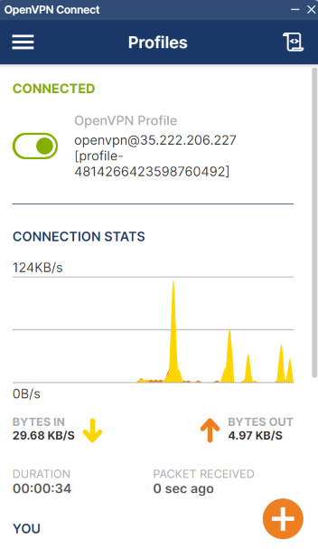

# Implementa una VPN en GCP con OpenVPN Access Server

Una VPN permite establecer una conexión segura y encriptada a través de una red menos segura, como Internet. Las VPNs son utilizadas para proteger la privacidad y la seguridad de los datos transmitidos, permitiendo a los usuarios acceder a recursos de red de manera segura desde ubicaciones remotas.

Este proyecto te guiará en la implementación de un servidor VPN utilizando OpenVPN Access Server en Google Cloud Platform (GCP). OpenVPN Access Server es una solución robusta y fácil de usar que proporciona una interfaz web para la administración y configuración de la VPN, facilitando la gestión de usuarios y la configuración de políticas de seguridad.

Al finalizar este proyecto, tendrás un servidor VPN desplegado en GCP que permitirá a los usuarios conectarse de manera segura a tu red, protegiendo sus datos y garantizando la privacidad de sus comunicaciones.

## Requisitos

### Terraform

Asegúrate de tener la versión correcta de Terraform (1.2.0+), puedes elegir el binario aquí:

https://releases.hashicorp.com/terraform/


### Proyecto en GCP

Necesitarás un proyecto en GCP con el api Compute Engine habilitado

## Uso

Crea un archivo terraform.tfvars con el valor de las variables. Por ejemplo:

```
project_id              = "your-project-id"
region                  = "your-region"
zone                    = "your-zone"
admin_password          = "admin-password"
network                 = "your-network"
sub_network             = "your-sub_networkk"
goog_cm_deployment_name = "openvpn"
```

Despues ejecuta el siguiente comando para desplegar tus cambios:

```
terraform apply
```

Una vez desplegados los cambios, autenticate en panel de administrador que veras en el output admin_url.


Navega a la sección Configuration > VPN settings y activa la opción `Should client Internet traffic be routed throught the VPN?` y `Have clients use specific DNS servers` con los valores que tu elijas. Por ejemplo los DNS servers de google son 8.8.8.8 y 8.8.4.4.


No te olvides de guardar los cambios y actualizar el servidor:


Navega a la sección User Management > User profiles y crea un nuevo profile. 


Esto hará que se descarge un archivo .ovpn que usaremos para configurar la conexión en el cliente vpn. Como cliente hemos usado [openvpn connect](https://openvpn.net/client/client-connect-vpn-for-windows/). Una vez instalado iniciamos el cliente, cargamos el archivo .ovpn que se descargó previamente y seleccionamos conectar.



Una vez conectados, podemos comprobar que ha cambiado nuestra ip por la ip del servidor VPN.

